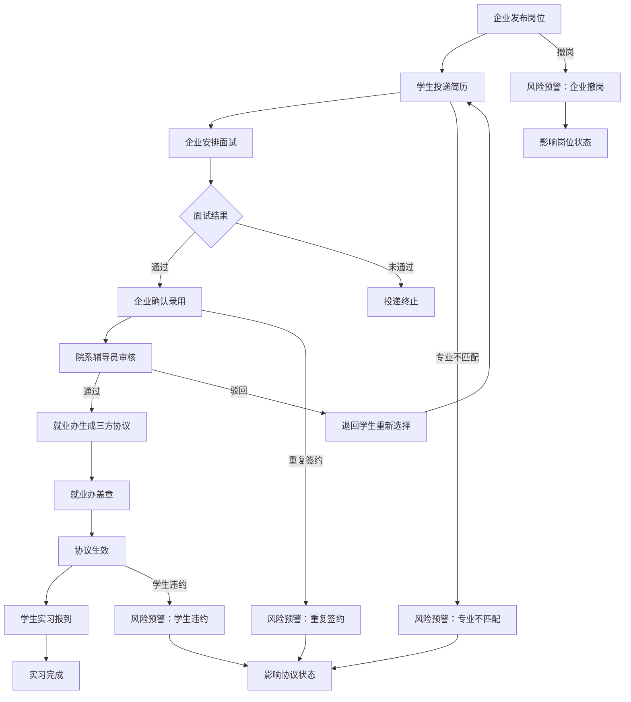

## 1. 产品概述

高校实习岗位管理平台，面向高校就业办、学生、企业导师和院系辅导员四类角色，实现从岗位发布到实习报到的全流程闭环管理。系统通过岗位池展示、投递进度追踪、三方协议流转和风险自动预警，解决实习管理中信息分散、流程脱节、风险难控的核心痛点。

- 目标用户：高校就业办管理员、在校学生、企业导师、院系辅导员
- 核心价值：将岗位发布、学生投递、企业面试、录用确认、院系审核、三方协议和实习报到连成完整闭环，并通过专业不匹配、重复签约、企业撤岗、学生违约等风险机制保障实习合规性

## 2. 核心功能

### 2.1 用户角色

| 角色 | 注册方式 | 核心权限 |
|------|----------|----------|
| 高校就业办 | 系统分配账号 | 三方协议管理、盖章审批、协议变更、违约处理、全局数据查看、风险处理 |
| 学生 | 学号注册登录 | 维护简历、课程安排、意向城市、投递岗位、查看投递进度和协议状态 |
| 企业导师 | 企业邮箱注册 | 发布岗位、设置薪资/地点/专业要求、面试管理、录用确认、撤岗操作 |
| 院系辅导员 | 系统分配账号 | 审核实习是否符合培养方案、查看本院系学生实习情况、审核通过/驳回 |

### 2.2 功能模块

1. **工作台仪表盘**：角色定制化统计概览、待办事项、风险提醒快捷入口、最近动态
2. **岗位池**：岗位列表与筛选、岗位详情（薪资/地点/专业要求/导师）、企业岗位发布/撤岗
3. **投递管理**：学生投递、投递进度追踪（投递→面试→录用→审核→协议→报到）、企业面试安排
4. **协议管理**：三方协议生成、盖章审批、协议变更、违约记录、协议状态流转
5. **风险提醒**：专业不匹配预警、重复签约检测、企业撤岗影响、学生违约告警
6. **学生档案**：简历维护、课程安排、意向城市、投递记录汇总
7. **审核中心**：院系审核实习合规性、就业办审核协议、审核通过/驳回

### 2.3 页面详情

| 页面名称 | 模块名称 | 功能描述 |
|----------|----------|----------|
| 工作台 | 统计卡片 | 岗位总数、投递总数、待审核数、活跃协议数，按角色显示不同统计 |
| 工作台 | 待办事项 | 各角色待处理事项列表，点击可跳转详情 |
| 工作台 | 风险预警 | 最新风险提醒摘要，标注风险等级和类型 |
| 工作台 | 最近动态 | 系统内最新操作记录时间线 |
| 岗位池 | 筛选栏 | 按专业、城市、薪资范围、企业名称筛选岗位 |
| 岗位池 | 岗位列表 | 卡片式展示岗位信息，含岗位名称、企业、薪资、地点、专业要求、状态标签 |
| 岗位池 | 岗位详情 | 弹窗或侧边栏展示完整岗位信息、企业导师信息、投递按钮 |
| 岗位池 | 发布岗位 | 企业导师填写岗位表单：名称、描述、地点、薪资、专业要求、人数 |
| 投递管理 | 投递列表 | 按状态分类展示投递记录（全部/待面试/已面试/已录用/已拒绝） |
| 投递管理 | 进度追踪 | 步骤条展示投递当前节点和已完成节点 |
| 投递管理 | 面试安排 | 企业端安排面试时间、地点、方式，通知学生 |
| 协议管理 | 协议列表 | 按状态展示三方协议（待生成/待盖章/已生效/变更中/已违约/已完成） |
| 协议管理 | 协议详情 | 协议三方信息、签署状态、盖章记录、变更历史 |
| 协议管理 | 盖章审批 | 就业办查看协议并盖章通过/驳回 |
| 协议管理 | 变更申请 | 发起协议变更（岗位变更、时间调整等），走审批流程 |
| 协议管理 | 违约处理 | 记录违约方、违约原因，更新协议和岗位状态 |
| 风险提醒 | 风险列表 | 按等级和类型展示所有风险项 |
| 风险提醒 | 风险详情 | 风险类型、涉及学生/企业/岗位、影响范围、处理建议 |
| 风险提醒 | 风险处理 | 标记已处理、添加处理备注 |
| 学生档案 | 基本信息 | 学生姓名、学号、专业、年级、联系方式 |
| 学生档案 | 简历维护 | 教育经历、技能特长、项目经验、自我评价 |
| 学生档案 | 课程安排 | 当前学期课程表，用于实习时间冲突检测 |
| 学生档案 | 意向城市 | 设置优先意向城市，用于岗位推荐 |
| 审核中心 | 院系审核 | 辅导员审核实习是否符合同专业培养方案要求 |
| 审核中心 | 协议审核 | 就业办审核三方协议完整性和合规性 |

## 3. 核心流程

### 3.1 实习全流程闭环

企业导师在平台上发布实习岗位（含地点、薪资、专业要求），学生浏览岗位池后投递简历，企业安排面试并确认录用，院系辅导员审核实习是否符合同专业培养方案，就业办生成三方协议并盖章，学生完成实习报到。任一环节出现风险（专业不匹配、重复签约、撤岗、违约）均会触发系统预警并影响后续状态流转。

### 3.2 流程图

### 3.3 风险影响规则

| 风险类型 | 触发条件 | 影响范围 | 状态变更 |
|----------|----------|----------|----------|
| 专业不匹配 | 学生专业不在岗位要求专业列表中 | 协议状态 | 院系审核自动标记为不通过，协议暂停生成 |
| 重复签约 | 学生在已有一条生效协议时再次投递或签约 | 投递与协议 | 阻止新投递进入录用确认，已有协议标记为待核实 |
| 企业撤岗 | 企业主动撤回已发布岗位 | 岗位与关联投递 | 岗位状态变为已撤回，所有待处理投递自动终止，已有协议标记为待变更 |
| 学生违约 | 学生在协议生效后主动取消或未按时报到 | 协议状态 | 协议状态变为已违约，学生标记违约记录，影响后续投递 |

## 4. 用户界面设计

### 4.1 设计风格

- 主色调：深青色 (#0F766E) 搭配暖橙色 (#F97316) 作为强调色，传递专业与活力
- 辅助色：石板灰 (#64748B) 用于次要信息，白色/浅灰背景营造清爽感
- 按钮风格：圆角按钮 (rounded-lg)，主操作用实色填充，次操作用描边样式
- 字体：标题使用 Noto Sans SC Bold，正文使用 Noto Sans SC Regular，数字使用 DM Sans
- 布局风格：左侧固定导航栏 + 顶部操作栏 + 内容区卡片式布局
- 图标风格：线性图标 (Lucide)，统一 18px 尺寸
- 风险等级色彩：高危红色 (#EF4444)、中危橙色 (#F97316)、低危蓝色 (#3B82F6)

### 4.2 页面设计概览

| 页面名称 | 模块名称 | UI元素 |
|----------|----------|--------|
| 工作台 | 统计卡片 | 4列网格卡片，每张卡片含图标、数字、标题、环比趋势箭头，卡片带微阴影和圆角 |
| 工作台 | 待办事项 | 白色卡片列表，左侧色条标识紧急程度，右侧操作按钮 |
| 工作台 | 风险预警 | 横向滚动风险卡片，红色/橙色/蓝色边框区分等级，含脉冲动画 |
| 工作台 | 最近动态 | 时间线布局，圆点+连线+内容卡片，时间标注在左侧 |
| 岗位池 | 筛选栏 | 顶部横向筛选标签组，支持多选，带搜索输入框 |
| 岗位池 | 岗位列表 | 3列卡片网格，每张卡片含岗位名称、企业Logo、薪资标签、地点、专业标签、状态徽章 |
| 岗位池 | 岗位详情 | 右侧滑出面板，头部大标题+企业信息，中间信息网格，底部操作按钮 |
| 岗位池 | 发布岗位 | 模态框表单，分区展示基本信息/要求设置/描述，底部提交/取消 |
| 投递管理 | 投递列表 | 表格布局，左侧状态标签列筛选，行内含进度条和操作按钮 |
| 投递管理 | 进度追踪 | 横向步骤条，已完成节点实色+勾选，当前节点脉冲动画，待完成节点虚线 |
| 协议管理 | 协议列表 | 状态标签页切换（全部/待盖章/已生效/变更中/已违约），表格+操作列 |
| 协议管理 | 协议详情 | 分区卡片展示：三方信息/签署状态/盖章记录/变更历史，时间线展示变更轨迹 |
| 风险提醒 | 风险列表 | 左侧筛选面板（类型/等级/状态），右侧风险卡片列表，含处理倒计时 |
| 学生档案 | 简历维护 | 左侧导航（基本信息/教育/技能/项目），右侧表单区，自动保存提示 |

### 4.3 响应式设计

- 桌面优先设计，最小支持 1280px 宽度
- 平板端（768px-1279px）：侧边栏折叠为图标模式，卡片网格从3列调整为2列
- 移动端（<768px）：侧边栏隐藏，底部导航栏，卡片单列展示

### 4.4 角色切换

系统顶部提供角色切换下拉菜单，可在四类角色间切换查看不同视角，方便演示和测试。
