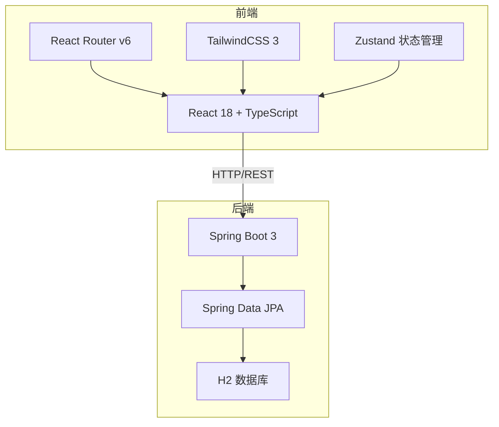
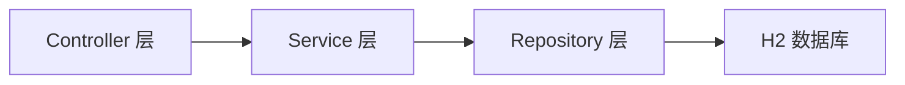
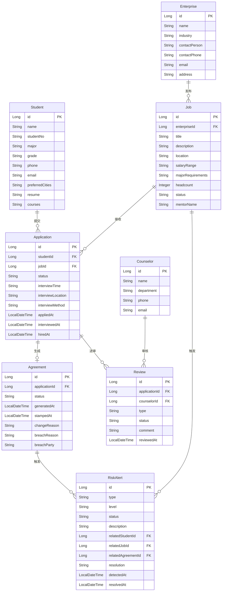

## 1. 架构设计



## 2. 技术说明

- 前端：React@18 + TypeScript + TailwindCSS@3 + Vite
- 初始化工具：Vite
- 后端：Spring Boot@3 + Spring Data JPA + H2 Database
- 数据库：H2（开发环境内嵌，Docker 部署时可切换为 MySQL）
- 状态管理：Zustand
- 路由：React Router v6
- 图标：Lucide React
- HTTP 客户端：Axios

## 3. 路由定义

| 路由 | 用途 |
|------|------|
| / | 工作台仪表盘，角色定制化统计和待办 |
| /jobs | 岗位池，岗位列表和筛选 |
| /applications | 投递管理，投递记录和进度追踪 |
| /agreements | 协议管理，三方协议列表和详情 |
| /risks | 风险提醒，风险列表和处理 |
| /students | 学生档案，简历和课程管理 |
| /reviews | 审核中心，院系审核和协议审核 |

## 4. API 定义

### 4.1 岗位相关

```
GET    /api/jobs              获取岗位列表（支持筛选参数）
POST   /api/jobs              发布岗位
GET    /api/jobs/{id}         获取岗位详情
PUT    /api/jobs/{id}         更新岗位信息
PUT    /api/jobs/{id}/withdraw 撤回岗位
```

### 4.2 投递相关

```
GET    /api/applications          获取投递列表（支持状态筛选）
POST   /api/applications          学生投递岗位
GET    /api/applications/{id}     获取投递详情
PUT    /api/applications/{id}/interview  安排面试
PUT    /api/applications/{id}/hire      确认录用
PUT    /api/applications/{id}/reject    拒绝录用
```

### 4.3 协议相关

```
GET    /api/agreements            获取协议列表（支持状态筛选）
POST   /api/agreements            生成三方协议
GET    /api/agreements/{id}       获取协议详情
PUT    /api/agreements/{id}/stamp 就业办盖章
PUT    /api/agreements/{id}/change 发起协议变更
PUT    /api/agreements/{id}/breach 处理违约
```

### 4.4 风险相关

```
GET    /api/risks                 获取风险列表（支持等级/类型筛选）
GET    /api/risks/{id}            获取风险详情
PUT    /api/risks/{id}/resolve    处理风险
```

### 4.5 学生相关

```
GET    /api/students              获取学生列表
GET    /api/students/{id}         获取学生详情
PUT    /api/students/{id}         更新学生信息
GET    /api/students/{id}/courses 获取课程安排
PUT    /api/students/{id}/courses 更新课程安排
```

### 4.6 审核相关

```
GET    /api/reviews               获取审核列表
PUT    /api/reviews/{id}/approve  审核通过
PUT    /api/reviews/{id}/reject   审核驳回
```

### 4.7 仪表盘

```
GET    /api/dashboard             获取仪表盘数据（统计、待办、风险、动态）
```

## 5. 服务端架构图



## 6. 数据模型

### 6.1 数据模型定义



### 6.2 数据定义语言

```sql
CREATE TABLE student (
    id BIGINT AUTO_INCREMENT PRIMARY KEY,
    name VARCHAR(50) NOT NULL,
    student_no VARCHAR(20) NOT NULL UNIQUE,
    major VARCHAR(50) NOT NULL,
    grade VARCHAR(10) NOT NULL,
    phone VARCHAR(20),
    email VARCHAR(100),
    preferred_cities VARCHAR(200),
    resume TEXT,
    courses TEXT,
    has_breach_record BOOLEAN DEFAULT FALSE
);

CREATE TABLE enterprise (
    id BIGINT AUTO_INCREMENT PRIMARY KEY,
    name VARCHAR(100) NOT NULL,
    industry VARCHAR(50),
    contact_person VARCHAR(50),
    contact_phone VARCHAR(20),
    email VARCHAR(100),
    address VARCHAR(200)
);

CREATE TABLE job (
    id BIGINT AUTO_INCREMENT PRIMARY KEY,
    enterprise_id BIGINT NOT NULL,
    title VARCHAR(100) NOT NULL,
    description TEXT,
    location VARCHAR(100),
    salary_range VARCHAR(50),
    major_requirements VARCHAR(500),
    headcount INT DEFAULT 1,
    status VARCHAR(20) DEFAULT 'OPEN',
    mentor_name VARCHAR(50),
    created_at TIMESTAMP DEFAULT CURRENT_TIMESTAMP,
    FOREIGN KEY (enterprise_id) REFERENCES enterprise(id)
);

CREATE TABLE application (
    id BIGINT AUTO_INCREMENT PRIMARY KEY,
    student_id BIGINT NOT NULL,
    job_id BIGINT NOT NULL,
    status VARCHAR(20) DEFAULT 'APPLIED',
    interview_time VARCHAR(50),
    interview_location VARCHAR(100),
    interview_method VARCHAR(20),
    applied_at TIMESTAMP DEFAULT CURRENT_TIMESTAMP,
    interviewed_at TIMESTAMP,
    hired_at TIMESTAMP,
    FOREIGN KEY (student_id) REFERENCES student(id),
    FOREIGN KEY (job_id) REFERENCES job(id)
);

CREATE TABLE agreement (
    id BIGINT AUTO_INCREMENT PRIMARY KEY,
    application_id BIGINT NOT NULL,
    status VARCHAR(20) DEFAULT 'PENDING',
    generated_at TIMESTAMP DEFAULT CURRENT_TIMESTAMP,
    stamped_at TIMESTAMP,
    change_reason TEXT,
    breach_reason TEXT,
    breach_party VARCHAR(20),
    FOREIGN KEY (application_id) REFERENCES application(id)
);

CREATE TABLE review (
    id BIGINT AUTO_INCREMENT PRIMARY KEY,
    application_id BIGINT NOT NULL,
    counselor_id BIGINT NOT NULL,
    type VARCHAR(20) DEFAULT 'DEPARTMENT',
    status VARCHAR(20) DEFAULT 'PENDING',
    comment TEXT,
    reviewed_at TIMESTAMP,
    FOREIGN KEY (application_id) REFERENCES application(id)
);

CREATE TABLE counselor (
    id BIGINT AUTO_INCREMENT PRIMARY KEY,
    name VARCHAR(50) NOT NULL,
    department VARCHAR(50) NOT NULL,
    phone VARCHAR(20),
    email VARCHAR(100)
);

CREATE TABLE risk_alert (
    id BIGINT AUTO_INCREMENT PRIMARY KEY,
    type VARCHAR(30) NOT NULL,
    level VARCHAR(10) NOT NULL,
    status VARCHAR(20) DEFAULT 'ACTIVE',
    description TEXT,
    related_student_id BIGINT,
    related_job_id BIGINT,
    related_agreement_id BIGINT,
    resolution TEXT,
    detected_at TIMESTAMP DEFAULT CURRENT_TIMESTAMP,
    resolved_at TIMESTAMP
);

CREATE INDEX idx_job_status ON job(status);
CREATE INDEX idx_application_student ON application(student_id);
CREATE INDEX idx_application_job ON application(job_id);
CREATE INDEX idx_application_status ON application(status);
CREATE INDEX idx_agreement_status ON agreement(status);
CREATE INDEX idx_review_status ON review(status);
CREATE INDEX idx_risk_type ON risk_alert(type);
CREATE INDEX idx_risk_status ON risk_alert(status);
```
